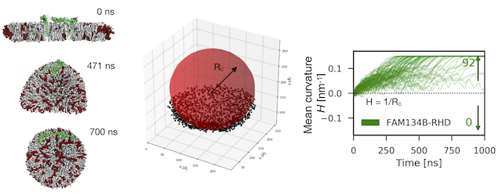
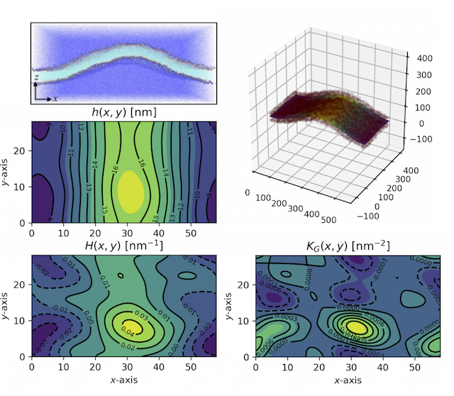

=====================================================
MEMBRANE SHAPE & CURVATURE
=====================================================

:Authors:       Ramachandra M. Bhaskara
:Year:          2019
:Licence:       GPLv3
:Copyright:      2019 Ramachandra M. Bhaskara, Gerhard Hummer
:References:    - [Bhaskara et al, 2019] Bhaskara RM, Grumati P, Garcia-Padro J, Kalayil S, Covurrbais-Pinto A, Chen W, Kudrashyev M, Dikic I, Hummer G. Curvature induction and sensing by FAM134B Reticulon homology domain assist selective-ER phagy.

Description
=============

This software package contains a three python programs used to

1. Compute curvatures of discontinuous membrane systems
2. a. Fit shape profiles of curved membranes under periodic boundary conditions.
   b. Compute local curvature properties of protein inclusions in curved membranes from optimized height profiles.

For a detailed description of the procedure and the algorithm, we refer to [Bhaskara et al, 2019].

Overview of the software
------------------------

This software contains two Python packages:

* "Fit_bicelle_sph_cap.py" provides algorithm for description of shape changes of a discontinuous membrane pathch. For.e.g. bicelle-to-vesicle conversion by patch-closure. The program uses least square fits for curved membrane-patches to spherical cup/cap shaped surfaces, to compute the constant mean curvature. 

* "Get_mem_profile_hcf_abcd.py" and "Cal_local_curv_props_abcd.py" are part of a combined package which provide algorithms for description of curved membrane surfaces under periodic boundary conditions. They can be used independently with a trajectory of curved membrane to quantify the membrane shapes and to compute local curvature properties of protein inclusion. 

Help
====

Please, if you have an issue with the software, open an issue here on the github repository https://github.com/bio-phys/curvature/issues .

Dependencies and Software Requirements
=========================================

* Python 2.7
* Python packages: numpy, scipy, MDAnalysis, pandas

Installation
============
No instalation required. Directly run the Python programs if the dependecies are installed before.

Usage
=====

1.      Needs two files from discontinuous simulations.
-       fam_bicelle.gro:        a configuration file from MARTINI simulation
-       fam_bicelle.xtc:        a processed GROMACS trajectory of the membrane patch, e.g. bicelle system.

..code-block:: bash 

./python Fit_bicelle_sph_cap.py

The output file contains

2.      Needs two files from the curved bilayer simulations under PBC conditions
-       fam_buckle.gro:         a configuration file of the curved bilayer from MARTINI simulation
-       fam_buckle_100ns.xtc:   a processed GROMACS trajectory of the buckled membrane simulation

..code-block:: bash

./python Get_mem_profile_hcf_abcd.py
./python Cal_local_curv_props_abcd.py

Other options and settings
--------------------------
Depending on membrane composition, the selection of atom type constituting the mid-plane of the bilayer needs to be selected. 

In curvature computations, If protein coordinates is provided, the local curvature is computed at the centre of mass of the protein atoms. 

Default settings
----------------

Output
------
Three output files are generated with default names.

Spherical surfaces of discontinuous membrane systems. 
-----------------------------------------
"Fit_bicelle_sph_cap.py" generates an output file "bicelle_curv_ts.dat" which contains 8 tab delimited columns
- 1     Trajectory frame/time
- 2     Radius of Fitted spherical surface [Angstroms]
- 3     Curvature of the fitted surface [1/Angstroms]
- 4-6   Co-ordinate of the centre of the fitted sphere [x_c, y_c, z_c]
- 7     Residual from the least square fit
- 8     Iterations

Shape profile of curved bilayer under PBC. 
-------------------------------------------
"Get_mem_profile_hcf_abcd.py" generates an output file "popf_1ns_k3_abcd_fam_buckled.dat" which contains optimized height coefficients describing the membrane shape profile. 
- 1     The first column contains the time/frame of the trajectory 
- 2-    to last columns contain different height coefficients. They can always be written as four kxk matrices.

Local curvarure of protein inclusion in curved bilayer under PBC.
---------------------------------------------------------------------------
"Cal_local_curv_props_abcd.py" generates an output file "fam_1ns_abcd_k3_curv_props.dat" which contains the local curvature properties of the sampled protein curvatures (tab delimited file).
- 1     Trajectory frame/time
- 2     Gaussian curvature K_G(x,y)
- 3     Mean curvature H(x,y)
- 4     Principal curvature k_1(x,y)
- 5     Principal curvature k_2(x,y)
- 6     Angle (deg) between local k_1(x,y) and e_x
- 7     Angle (deg) between local k_2(x,y) and e_x
- 8-13  same as 2-7, but computed for amphipathic helix 1 (AmpH1).
- 14-19 same as 2-7, but computed for amphipathic helix 2 (AmpH2).
- 20    Angle (deg) between AmpH1 and e_x
- 21    Angle (deg) between AmpH2 and e_x
- 22    Angle (deg) between AmpH1 and AmpH2
- 23    Angle (deg) between AmpH1 and k_1(x,y)
- 24    Angle (deg) between AmpH2 and k_1(x,y)
- 25-26 x, y coordinates defining the COM of protein.

FAQs
====
Q: My curvature values have negative instead of positive values. What is going on?

A: The sign of the curvature is dictated by convention. In the Monge representation, using h(x,y) representation of the membrane profile gives the curvature of the lower leaflet of the profile. To compute curvatues along upper leaflet, as in the manuscript (Shape operator S=-S).

Q: How is the sign of the bicelle curvature decided?

A: The bicelle curvature sign depends on the lipid flip-flop at the open edge. If more than 50 % upper leaflet lipids from the starting structure flip onto the lower leaflet, the sign of the curvature is negative.
